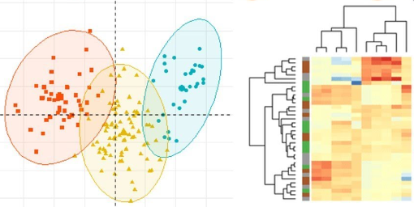
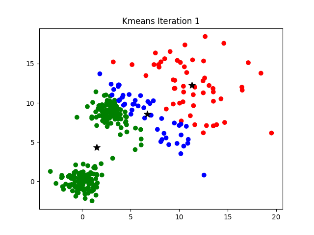
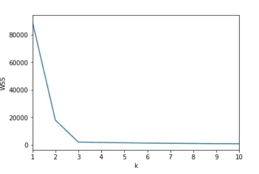
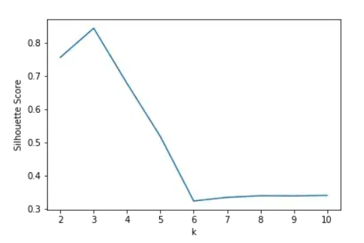

# What is Clustering?
Clustering refers to the process of generating labeled groups of data based on how **similar** they are.
_Clustering_ is **similar** to _Classification_, but not quite the same...

## Characteristics
:::::: {.columns}
::: {.column}

- Clustering is a method of **UNSUPERVISED LEARNING**
  - So, it has no _target_ or _ground truth_ to estimate.
- Does not have a specific label order
- Can group the data through different methods:
  - K-means
  - K-nearest neighbors
  - Hierarchical clustering

:::
::: {.column}

:::
::::::

# Why do we cluster?

Given a collection of data objects, we want to form groups of data that is similar and dissimilar from other data.
When we make these groups we do not really care how our data is presented as long as it is grouped.

:::::: {.columns}
::: {.column}

A typical cluster contains as a result:

- Data observations similar to one another within the cluster
- Data observations dissimilar to objects in other clusters

## Types of clustering

In this presentation we will focus two types of clustering:

- **K-means clustering**: measures the distance from a data point to a centroid.
- **Hierarchical clustering**: measures the similarity between pairs of ponts and forms clusters from it.

:::
::: {.column}

:::
::::::

# K-means clustering

## What is it?
An algorithm that groups the data based on its euclidean distance in a certain dimension against a centroid.
The data will be separated in **_K_** clusters _(arbitrary)_ and calculate the distance of the data to the centroid.

:::::: {.columns}
::: {.column}

## How does it work?
_K-means clustering_ method works based on the following steps:

1. The computer has **K** centroids in determined locations in the data spectrum.
2. The computer computes the distance between the data points and the centroids.
3. The computer labels the points that are the **nearest** to each centroid.
4. The computer moves the centroid to the **mean** point of the labeled data.

:::
::: {.column}

:::
::::::

# Advantages and Disadvantages
:::::: {.columns}
::: {.column}

## Advantages
The K-means method presents the following advantages:

- It is one of the fastest clustering methods.
- It is relatively simple and technologically cheap.
- Will always converge.
- Can easily cluster big amounts of data.
- It does not matter where the centroids start.
- Can generalize itself to clusters with different shapes an size.

:::
::: {.column}

## Disadvantages
Some of the disadvantages of this method are:

- _K_ is arbitrary.
- It is highly dependant on initial conditions.
- Has dificulty grouping data of clusters with different shape and size.
- Outlier values can drag the clusters.
- Escalates badly with a high number of dimensions.

:::
::::::

---

# What about _K_?
One of the problems is that _K_ is arbitrary and we have to decide it ourselves. There is an amount of methods to retrieve
it, and choose the optimal _K_.

:::::: {.columns}
::: {.column}

## The elbow method
The calculation of the _Within-Cluster-Sum of Squared Errors (WSS)_ for different values of _K_ and choose the _K_ for which the _WSS_
starts to diminish. If you plot the WSS against K, it will look as an _elbow_. We look for the _elbow_ point of the graph, where the _k_
is optimal.

:::
::: {.column}

## The silhouette method
The silhouette value measures how a point is similar to its own centroid. Valued between _(-1, +1)_, with one being the most similar to
the centroid, and -1 being the least similar to the centroid. We look for the maximum value of the silhouette.

:::
::::::

# Hierarchical Clustering
Hierarchical clustering is a clustering method focused on the grouping of data points based on the similarity between one another. This
in turn generates super-clusters of the initial clusters. This method has two categories:

:::::: {.columns}
::: {.column}

## Aglomerative
Known as the _bottom-up_ approach: Each observation starts as its own cluster, and pairs of clusters are formed while we move up the hierarchy.

:::
::: {.column}

## Divisive
Known as the _top-down_ approach: 

:::
::::::