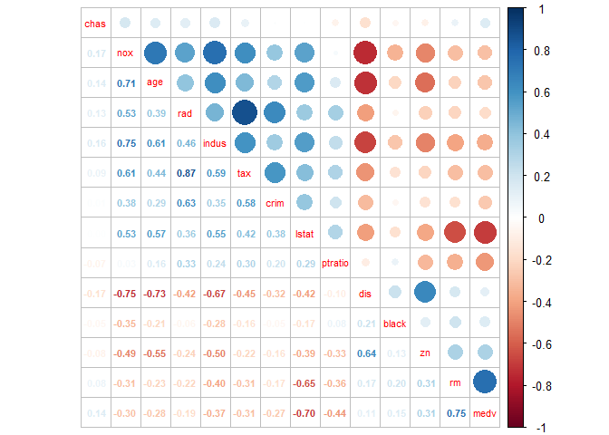
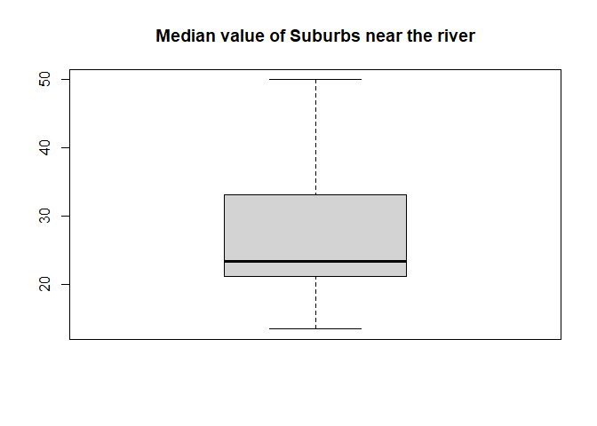
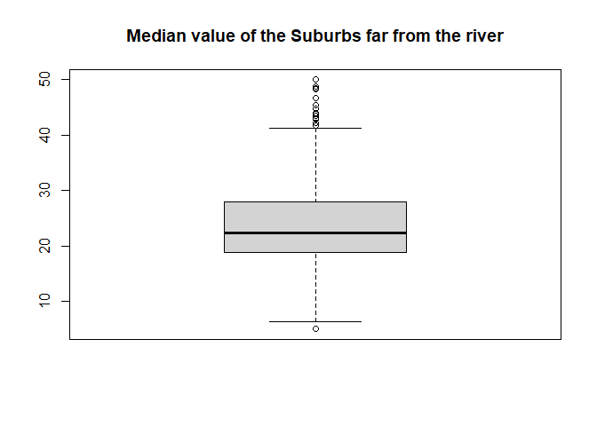

Gonzalez_Mario_40
================
PWD-3
05/10/2022

- <a href="#loading-the-dataset" id="toc-loading-the-dataset">Loading the
  dataset.</a>
- <a href="#split-the-dataset-into-training-and-test-sets"
  id="toc-split-the-dataset-into-training-and-test-sets">Split the dataset
  into training and test sets</a>
- <a href="#check-relationship-between-variables"
  id="toc-check-relationship-between-variables">Check relationship between
  variables</a>
- <a href="#fit-a-linear-model-of-the-house-pricing-in-function-of-age"
  id="toc-fit-a-linear-model-of-the-house-pricing-in-function-of-age">Fit
  a linear model of the house pricing in function of age</a>
- <a href="#train-a-linear-model-using-age-and-lstat-as-predictors"
  id="toc-train-a-linear-model-using-age-and-lstat-as-predictors">Train a
  linear model using <em>age</em> and <em>lstat</em> as predictors</a>
- <a href="#training-a-model-using-all-of-the-variables-in-the-dataset"
  id="toc-training-a-model-using-all-of-the-variables-in-the-dataset">Training
  a model using all of the variables in the dataset</a>
- <a href="#check-correlation-matrix-in-the-dataset"
  id="toc-check-correlation-matrix-in-the-dataset">Check correlation
  matrix in the dataset</a>
- <a href="#train-a-new-model-without-tax"
  id="toc-train-a-new-model-without-tax">Train a new model without
  <em>tax</em></a>
  - <a href="#mean-square-error" id="toc-mean-square-error">Mean Square
    Error</a>
- <a href="#anova" id="toc-anova">ANOVA</a>
- <a href="#qualitative-predictors"
  id="toc-qualitative-predictors">Qualitative predictors</a>
- <a href="#interaction-terms" id="toc-interaction-terms">Interaction
  terms</a>

In this document we will explore the Multiple Linear Regression using
the **Boston** dataset. This dataset records the median values of the
houses of 506 neighbourhoods in Boston. We have the dependent variable
`medv` in the dataset as the median value of the houses.

# Loading the dataset.

In this section, we will upload the *Boston* dataset into the R session
from the *MASS* package.

``` r
library(MASS)
data(Boston)
knitr::kable(head(Boston))
```

|    crim |  zn | indus | chas |   nox |    rm |  age |    dis | rad | tax | ptratio |  black | lstat | medv |
|--------:|----:|------:|-----:|------:|------:|-----:|-------:|----:|----:|--------:|-------:|------:|-----:|
| 0.00632 |  18 |  2.31 |    0 | 0.538 | 6.575 | 65.2 | 4.0900 |   1 | 296 |    15.3 | 396.90 |  4.98 | 24.0 |
| 0.02731 |   0 |  7.07 |    0 | 0.469 | 6.421 | 78.9 | 4.9671 |   2 | 242 |    17.8 | 396.90 |  9.14 | 21.6 |
| 0.02729 |   0 |  7.07 |    0 | 0.469 | 7.185 | 61.1 | 4.9671 |   2 | 242 |    17.8 | 392.83 |  4.03 | 34.7 |
| 0.03237 |   0 |  2.18 |    0 | 0.458 | 6.998 | 45.8 | 6.0622 |   3 | 222 |    18.7 | 394.63 |  2.94 | 33.4 |
| 0.06905 |   0 |  2.18 |    0 | 0.458 | 7.147 | 54.2 | 6.0622 |   3 | 222 |    18.7 | 396.90 |  5.33 | 36.2 |
| 0.02985 |   0 |  2.18 |    0 | 0.458 | 6.430 | 58.7 | 6.0622 |   3 | 222 |    18.7 | 394.12 |  5.21 | 28.7 |

As we can see, we can see the different variables that compose the
dataset, and at the right side of the table, we can see the *medv* posed
as the median value of the houses.

# Split the dataset into training and test sets

In this section, we will take the dataset and split it into fixed sets
*(**training** set and **test** set)*. We will take the *train-test
ratio* will be 80% to 20% of training and test sets, meaning that we
will take 400 observations for the training set and the rest of the
observations for the test set.

``` r
boston_train <- Boston[1:400, ]
boston_test <- Boston[401:506, ]

summary(boston_train)
```

    ##       crim                zn             indus             chas       
    ##  Min.   : 0.00632   Min.   :  0.00   Min.   : 0.460   Min.   :0.0000  
    ##  1st Qu.: 0.06610   1st Qu.:  0.00   1st Qu.: 4.125   1st Qu.:0.0000  
    ##  Median : 0.16073   Median :  0.00   Median : 7.015   Median :0.0000  
    ##  Mean   : 1.75086   Mean   : 14.38   Mean   : 9.416   Mean   :0.0875  
    ##  3rd Qu.: 0.73192   3rd Qu.: 21.00   3rd Qu.:13.920   3rd Qu.:0.0000  
    ##  Max.   :88.97620   Max.   :100.00   Max.   :25.650   Max.   :1.0000  
    ##       nox               rm             age              dis        
    ##  Min.   :0.3850   Min.   :3.561   Min.   :  2.90   Min.   : 1.130  
    ##  1st Qu.:0.4420   1st Qu.:5.891   1st Qu.: 37.67   1st Qu.: 2.341  
    ##  Median :0.5055   Median :6.228   Median : 68.75   Median : 3.876  
    ##  Mean   :0.5301   Mean   :6.336   Mean   : 64.08   Mean   : 4.200  
    ##  3rd Qu.:0.5810   3rd Qu.:6.686   3rd Qu.: 91.90   3rd Qu.: 5.659  
    ##  Max.   :0.8710   Max.   :8.780   Max.   :100.00   Max.   :12.127  
    ##       rad              tax           ptratio         black      
    ##  Min.   : 1.000   Min.   :187.0   Min.   :12.6   Min.   : 70.8  
    ##  1st Qu.: 4.000   1st Qu.:276.0   1st Qu.:16.6   1st Qu.:381.2  
    ##  Median : 5.000   Median :307.0   Median :18.4   Median :392.5  
    ##  Mean   : 6.617   Mean   :349.8   Mean   :18.0   Mean   :379.9  
    ##  3rd Qu.: 6.000   3rd Qu.:403.0   3rd Qu.:20.2   3rd Qu.:396.5  
    ##  Max.   :24.000   Max.   :666.0   Max.   :22.0   Max.   :396.9  
    ##      lstat             medv      
    ##  Min.   : 1.730   Min.   : 5.00  
    ##  1st Qu.: 6.285   1st Qu.:18.90  
    ##  Median : 9.605   Median :22.50  
    ##  Mean   :11.251   Mean   :24.33  
    ##  3rd Qu.:14.477   3rd Qu.:28.25  
    ##  Max.   :37.970   Max.   :50.00

``` r
knitr::kable(head(boston_train))
```

|    crim |  zn | indus | chas |   nox |    rm |  age |    dis | rad | tax | ptratio |  black | lstat | medv |
|--------:|----:|------:|-----:|------:|------:|-----:|-------:|----:|----:|--------:|-------:|------:|-----:|
| 0.00632 |  18 |  2.31 |    0 | 0.538 | 6.575 | 65.2 | 4.0900 |   1 | 296 |    15.3 | 396.90 |  4.98 | 24.0 |
| 0.02731 |   0 |  7.07 |    0 | 0.469 | 6.421 | 78.9 | 4.9671 |   2 | 242 |    17.8 | 396.90 |  9.14 | 21.6 |
| 0.02729 |   0 |  7.07 |    0 | 0.469 | 7.185 | 61.1 | 4.9671 |   2 | 242 |    17.8 | 392.83 |  4.03 | 34.7 |
| 0.03237 |   0 |  2.18 |    0 | 0.458 | 6.998 | 45.8 | 6.0622 |   3 | 222 |    18.7 | 394.63 |  2.94 | 33.4 |
| 0.06905 |   0 |  2.18 |    0 | 0.458 | 7.147 | 54.2 | 6.0622 |   3 | 222 |    18.7 | 396.90 |  5.33 | 36.2 |
| 0.02985 |   0 |  2.18 |    0 | 0.458 | 6.430 | 58.7 | 6.0622 |   3 | 222 |    18.7 | 394.12 |  5.21 | 28.7 |

``` r
summary(boston_test)
```

    ##       crim                zn        indus            chas        nox        
    ##  Min.   : 0.04527   Min.   :0   Min.   : 9.69   Min.   :0   Min.   :0.5320  
    ##  1st Qu.: 4.36716   1st Qu.:0   1st Qu.:18.10   1st Qu.:0   1st Qu.:0.5850  
    ##  Median : 7.46495   Median :0   Median :18.10   Median :0   Median :0.6550  
    ##  Mean   :10.64245   Mean   :0   Mean   :17.63   Mean   :0   Mean   :0.6474  
    ##  3rd Qu.:12.66352   3rd Qu.:0   3rd Qu.:18.10   3rd Qu.:0   3rd Qu.:0.7130  
    ##  Max.   :73.53410   Max.   :0   Max.   :27.74   Max.   :0   Max.   :0.7400  
    ##        rm             age              dis             rad       
    ##  Min.   :4.138   Min.   : 28.80   Min.   :1.178   Min.   : 1.00  
    ##  1st Qu.:5.800   1st Qu.: 78.25   1st Qu.:1.864   1st Qu.:24.00  
    ##  Median :6.157   Median : 90.75   Median :2.178   Median :24.00  
    ##  Mean   :6.090   Mean   : 85.53   Mean   :2.268   Mean   :20.61  
    ##  3rd Qu.:6.423   3rd Qu.: 97.38   3rd Qu.:2.560   3rd Qu.:24.00  
    ##  Max.   :7.393   Max.   :100.00   Max.   :4.098   Max.   :24.00  
    ##       tax           ptratio          black            lstat      
    ##  Min.   :273.0   Min.   :19.20   Min.   :  0.32   Min.   : 5.64  
    ##  1st Qu.:666.0   1st Qu.:20.20   1st Qu.: 97.03   1st Qu.:14.11  
    ##  Median :666.0   Median :20.20   Median :362.01   Median :17.62  
    ##  Mean   :628.8   Mean   :20.16   Mean   :269.20   Mean   :17.95  
    ##  3rd Qu.:666.0   3rd Qu.:20.20   3rd Qu.:394.77   3rd Qu.:21.30  
    ##  Max.   :711.0   Max.   :21.00   Max.   :396.90   Max.   :36.98  
    ##       medv      
    ##  Min.   : 5.00  
    ##  1st Qu.:11.90  
    ##  Median :15.20  
    ##  Mean   :15.73  
    ##  3rd Qu.:19.90  
    ##  Max.   :29.80

``` r
knitr::kable(head(boston_test))
```

|     |     crim |  zn | indus | chas |   nox |    rm |   age |    dis | rad | tax | ptratio |  black | lstat | medv |
|:----|---------:|----:|------:|-----:|------:|------:|------:|-------:|----:|----:|--------:|-------:|------:|-----:|
| 401 | 25.04610 |   0 |  18.1 |    0 | 0.693 | 5.987 | 100.0 | 1.5888 |  24 | 666 |    20.2 | 396.90 | 26.77 |  5.6 |
| 402 | 14.23620 |   0 |  18.1 |    0 | 0.693 | 6.343 | 100.0 | 1.5741 |  24 | 666 |    20.2 | 396.90 | 20.32 |  7.2 |
| 403 |  9.59571 |   0 |  18.1 |    0 | 0.693 | 6.404 | 100.0 | 1.6390 |  24 | 666 |    20.2 | 376.11 | 20.31 | 12.1 |
| 404 | 24.80170 |   0 |  18.1 |    0 | 0.693 | 5.349 |  96.0 | 1.7028 |  24 | 666 |    20.2 | 396.90 | 19.77 |  8.3 |
| 405 | 41.52920 |   0 |  18.1 |    0 | 0.693 | 5.531 |  85.4 | 1.6074 |  24 | 666 |    20.2 | 329.46 | 27.38 |  8.5 |
| 406 | 67.92080 |   0 |  18.1 |    0 | 0.693 | 5.683 | 100.0 | 1.4254 |  24 | 666 |    20.2 | 384.97 | 22.98 |  5.0 |

# Check relationship between variables

We then have to check if there is a linear relationship between the
`age` and `medv` variables.

``` r
print(cor(boston_train$age, boston_train$medv))
```

    ## [1] -0.278153

As we can see from the result, there is a very weak linear relationship
between the `age` and the `medv` variables of the dataset. This means
that if there is a relationship between both variables, it is definitely
a non-linear relationship, and it is more complex than a simple line.

# Fit a linear model of the house pricing in function of age

In this step we will fit a model of the house pricing based on the `age`
variable and visualize its behaviour with the actual data.

``` r
model <- lm(medv ~ age, data = boston_train)
summary(model)
```

    ## 
    ## Call:
    ## lm(formula = medv ~ age, data = boston_train)
    ## 
    ## Residuals:
    ##     Min      1Q  Median      3Q     Max 
    ## -16.828  -5.409  -2.538   2.881  28.824 
    ## 
    ## Coefficients:
    ##             Estimate Std. Error t value Pr(>|t|)    
    ## (Intercept) 29.97014    1.07047  27.997  < 2e-16 ***
    ## age         -0.08794    0.01522  -5.777 1.53e-08 ***
    ## ---
    ## Signif. codes:  0 '***' 0.001 '**' 0.01 '*' 0.05 '.' 0.1 ' ' 1
    ## 
    ## Residual standard error: 8.815 on 398 degrees of freedom
    ## Multiple R-squared:  0.07737,    Adjusted R-squared:  0.07505 
    ## F-statistic: 33.38 on 1 and 398 DF,  p-value: 1.534e-08

``` r
plot(
    boston_train$age,
    boston_train$medv,
    col = "blue",
    cex = 1,
    pch = 16,
    main = "House pricing by age",
    ylab = "median value (medv)",
    xlab = "age (age)"
)
abline(model, col = "red")
```

<!-- -->

As we can see in the model, the regression line is described as a linear
model as we used `medv ~ age` in the linear model fitting. This gave us
a linear function with the form
,
using the parameters seen above.

# Train a linear model using *age* and *lstat* as predictors

In this step we will generate a model that will describe the behaviour
of the `medv` variable using the `age` and `lstat` variables as
predictors. Taking in account that in the *PW2* document we used a
similar model using `lstat` as a predictor, we will apply the same
modification as that model, and use `log(lstat)` instead of using it
directly.

``` r
model0 <- lm(medv ~ log(lstat) + age, data = boston_train)
summary(model0)
```

    ## 
    ## Call:
    ## lm(formula = medv ~ log(lstat) + age, data = boston_train)
    ## 
    ## Residuals:
    ##      Min       1Q   Median       3Q      Max 
    ## -13.5262  -3.3942  -0.8392   2.7503  22.9450 
    ## 
    ## Coefficients:
    ##              Estimate Std. Error t value Pr(>|t|)    
    ## (Intercept)  51.60212    1.03643  49.788  < 2e-16 ***
    ## log(lstat)  -14.33897    0.53904 -26.601  < 2e-16 ***
    ## age           0.07779    0.01106   7.034 8.85e-12 ***
    ## ---
    ## Signif. codes:  0 '***' 0.001 '**' 0.01 '*' 0.05 '.' 0.1 ' ' 1
    ## 
    ## Residual standard error: 5.292 on 397 degrees of freedom
    ## Multiple R-squared:  0.6684, Adjusted R-squared:  0.6667 
    ## F-statistic: 400.1 on 2 and 397 DF,  p-value: < 2.2e-16

In this case, we can see that the obtained model is a non-linear model,
described by the following equation.

 + \beta_2x_2")

As we can see, the model uses now two factor parameters
 and
 for the
predictors. The summary of the model shows levels of significance for
} < 2*10^{-16}")
and
,
which means a very high level of significance for each of the predictor
parameters. The levels of significance show that the variable
`log(lstat)` is more significant to the model than the `age` variable,
although the `age` is highly significant to this model.

The summary of this model shows as a *F-statistic* score of 400.1 using
the Fisher method with 397 degrees of freedom. This score leads us to
obtain a general P-value
,
which means that we are confident *(more than 99.99%)* that the model
correctly describes the behaviour of the data we are presenting. To
summarize, we can say that **this model is highly significant as a
whole**.

# Training a model using all of the variables in the dataset

In this section we will train a new model using all of the available
variables in the dataset. We will fit the model using a linear function
in order to see how the variables interact with each other.

``` r
model1 <- lm(medv ~ ., data = boston_train)
summary(model1)
```

    ## 
    ## Call:
    ## lm(formula = medv ~ ., data = boston_train)
    ## 
    ## Residuals:
    ##      Min       1Q   Median       3Q      Max 
    ## -20.5636  -2.6945  -0.6151   1.6949  25.0328 
    ## 
    ## Coefficients:
    ##               Estimate Std. Error t value Pr(>|t|)    
    ## (Intercept)  28.672600   6.151703   4.661 4.34e-06 ***
    ## crim         -0.191246   0.054036  -3.539 0.000450 ***
    ## zn            0.044229   0.014111   3.134 0.001854 ** 
    ## indus         0.055221   0.065532   0.843 0.399944    
    ## chas          1.716314   0.891171   1.926 0.054850 .  
    ## nox         -14.995722   4.557588  -3.290 0.001093 ** 
    ## rm            4.887730   0.484947  10.079  < 2e-16 ***
    ## age           0.002609   0.014330   0.182 0.855615    
    ## dis          -1.294808   0.211724  -6.116 2.36e-09 ***
    ## rad           0.484787   0.087347   5.550 5.31e-08 ***
    ## tax          -0.015401   0.004447  -3.463 0.000594 ***
    ## ptratio      -0.808795   0.140085  -5.774 1.60e-08 ***
    ## black        -0.001292   0.006537  -0.198 0.843381    
    ## lstat        -0.517954   0.059511  -8.704  < 2e-16 ***
    ## ---
    ## Signif. codes:  0 '***' 0.001 '**' 0.01 '*' 0.05 '.' 0.1 ' ' 1
    ## 
    ## Residual standard error: 4.808 on 386 degrees of freedom
    ## Multiple R-squared:  0.7339, Adjusted R-squared:  0.7249 
    ## F-statistic: 81.87 on 13 and 386 DF,  p-value: < 2.2e-16

As we see above, this new model implements all of the data in our
dataset, and it also is described by a linear equation containing each
of the variables to describe the median value of the houses of each
neighbourhood. This model uses all of the variables directly, so it
essentially undid the transformation applied to the variable `lsat`. We
will train our next model taking the logarithmic transformation in
account.

``` r
model2 <- lm(
    medv ~ log(lstat) + crim + zn + indus + chas + nox +
        rm + age + dis + rad + tax + ptratio + black,
    data = boston_train
)
summary(model2)
```

    ## 
    ## Call:
    ## lm(formula = medv ~ log(lstat) + crim + zn + indus + chas + nox + 
    ##     rm + age + dis + rad + tax + ptratio + black, data = boston_train)
    ## 
    ## Residuals:
    ##      Min       1Q   Median       3Q      Max 
    ## -18.2659  -2.6704  -0.2681   1.8802  23.5614 
    ## 
    ## Coefficients:
    ##               Estimate Std. Error t value Pr(>|t|)    
    ## (Intercept)  48.806352   5.893689   8.281 2.02e-15 ***
    ## log(lstat)   -8.795266   0.645758 -13.620  < 2e-16 ***
    ## crim         -0.178036   0.048043  -3.706 0.000242 ***
    ## zn            0.026440   0.012689   2.084 0.037844 *  
    ## indus         0.033649   0.058697   0.573 0.566804    
    ## chas          1.546766   0.801204   1.931 0.054271 .  
    ## nox         -14.007310   4.095065  -3.421 0.000692 ***
    ## rm            3.321905   0.461808   7.193 3.31e-12 ***
    ## age           0.030437   0.013144   2.316 0.021104 *  
    ## dis          -1.109645   0.191150  -5.805 1.34e-08 ***
    ## rad           0.418017   0.078728   5.310 1.86e-07 ***
    ## tax          -0.014570   0.003994  -3.648 0.000300 ***
    ## ptratio      -0.736532   0.126126  -5.840 1.11e-08 ***
    ## black        -0.001398   0.005866  -0.238 0.811709    
    ## ---
    ## Signif. codes:  0 '***' 0.001 '**' 0.01 '*' 0.05 '.' 0.1 ' ' 1
    ## 
    ## Residual standard error: 4.321 on 386 degrees of freedom
    ## Multiple R-squared:  0.785,  Adjusted R-squared:  0.7777 
    ## F-statistic: 108.4 on 13 and 386 DF,  p-value: < 2.2e-16

As we can see in both of the summaries of each model containing the
complete dataset, the *R-square* score shows a high approximation of
each model to the behaviour of the given data. In this case, the model
containing the logarithmic approach to the `lstat` variable shows a
higher *R-square* score, being
.
In the other hand, the model containing the direct variables shows a
lower *R-square* score, being
.
This shows that the model containing the logarithmic transformation
describes better the behaviour of the `medv` variable in the given
dataset.

# Check correlation matrix in the dataset

In this section we will check the correlation matrix of the
`boston_train` dataset in order to see if any of the behaviour of the
variables can be described as dependent of another variable. The
following code will generate the correlation matrix of the training set
and round its values to two digits. Afterwards, it will show the
correlation matrix in order to easily visualize the correlation between
each variable in the dataset.

``` r
boston_correlation <- round(cor(boston_train), 2)
corrplot::corrplot.mixed(
    boston_correlation,
    order = "AOE",
    number.cex = 0.7,
    tl.cex = 0.7
)
```

<!-- -->

As we can observe in the correlation matrix, the maximum correlation in
the dataset corresponds to the variables `tax` and `rad` (0.87), which
means that we can say that they are linearly dependent on each other,
and at least one of them does not contribute to the model in a
significant way.

# Train a new model without *tax*

Now we will train a new model without the `tax` variable, in order to
decrease the correlation issues in the predictors.

``` r
model3 <- lm(
    medv ~ log(lstat) + crim + zn + indus + chas +
        nox + rm + age + dis + rad + ptratio + black,
    data = boston_train
)
summary(model3)
```

    ## 
    ## Call:
    ## lm(formula = medv ~ log(lstat) + crim + zn + indus + chas + nox + 
    ##     rm + age + dis + rad + ptratio + black, data = boston_train)
    ## 
    ## Residuals:
    ##      Min       1Q   Median       3Q      Max 
    ## -18.8470  -2.5354  -0.2791   1.9508  23.3798 
    ## 
    ## Coefficients:
    ##               Estimate Std. Error t value Pr(>|t|)    
    ## (Intercept)  4.624e+01  5.944e+00   7.779 6.70e-14 ***
    ## log(lstat)  -8.753e+00  6.558e-01 -13.347  < 2e-16 ***
    ## crim        -1.844e-01  4.877e-02  -3.782 0.000180 ***
    ## zn           1.692e-02  1.261e-02   1.341 0.180600    
    ## indus       -3.080e-02  5.686e-02  -0.542 0.588310    
    ## chas         1.845e+00  8.096e-01   2.279 0.023184 *  
    ## nox         -1.598e+01  4.123e+00  -3.876 0.000125 ***
    ## rm           3.431e+00  4.681e-01   7.329 1.36e-12 ***
    ## age          2.882e-02  1.334e-02   2.160 0.031412 *  
    ## dis         -1.146e+00  1.939e-01  -5.909 7.54e-09 ***
    ## rad          2.063e-01  5.403e-02   3.817 0.000157 ***
    ## ptratio     -7.658e-01  1.279e-01  -5.989 4.82e-09 ***
    ## black        3.066e-04  5.940e-03   0.052 0.958855    
    ## ---
    ## Signif. codes:  0 '***' 0.001 '**' 0.01 '*' 0.05 '.' 0.1 ' ' 1
    ## 
    ## Residual standard error: 4.39 on 387 degrees of freedom
    ## Multiple R-squared:  0.7775, Adjusted R-squared:  0.7706 
    ## F-statistic: 112.7 on 12 and 387 DF,  p-value: < 2.2e-16

Given the new trained model, we can observe that the *R-square* results
in the model have been lowered due to the elimination of one of the
predictors in the model, which can lower a bit the approximation of the
model. But, in the other hand, the F-statistic score has increased
compared to the last model trained. This means that the P-value has
decreased even more, and this model is more significant than the others
thanks to the elimination of the `tax` from the model.

## Mean Square Error

A we have observed, the `model3` is the best model by far in this
exercise, and that it does not need all of the predictors in order to
work. We will now calculate the *Mean Square Error* of the model with
the given training set.

``` r
mean((summary(model3))$residuals^2)
```

    ## [1] 18.64307

# ANOVA

In this section we will perform an **Analysis Of Variance** *(ANOVA)*
around the categorical variable `chas` in the dataset. In this dataset,
`chas` refers to a neighbourhood close to the *Charles River (1 for
‘yes’, 0 for ‘no’)*. We will check if there is a difference between the
mean of the `medv` values in the neighbourhoods that are close to this
river and those that are not, following the next assumtion.


For this, we will first visualize how is the `chas` variable is present
throughout the dataset.

``` r
str(boston_train$chas)
```

    ##  int [1:400] 0 0 0 0 0 0 0 0 0 0 ...

For now, we have confirmed that the `chas` variable effectively contains
values as 0 and 1 as stated earlier. Now, we will count how many of the
observations present in the dataset are near the river.

``` r
btr_chas <- boston_train[boston_train$chas == 1, ]
btr_nochas <- boston_train[boston_train$chas == 0, ]

boxplot(
    btr_chas$medv,
    main = "Median value of Suburbs near the river"
)
```

<!-- -->

``` r
boxplot(
    btr_nochas$medv,
    main = "Median value of the Suburbs far from the river"
)
```

<!-- -->

As we can see, the median values of the suburbs far from the river tend
to mantain their bounds between 10 and 45 with some suburbs being
outliers, while the values of the suburbs bounding the river tend to
disipate more.

``` r
aggregate(medv ~ chas, data = boston_train, mean)
```

    ##   chas     medv
    ## 1    0 23.94082
    ## 2    1 28.44000

``` r
bchas_aov <- aov(medv ~ chas, data = boston_train)
print(bchas_aov)
```

    ## Call:
    ##    aov(formula = medv ~ chas, data = boston_train)
    ## 
    ## Terms:
    ##                     chas Residuals
    ## Sum of Squares    646.50  32876.31
    ## Deg. of Freedom        1       398
    ## 
    ## Residual standard error: 9.088662
    ## Estimated effects may be unbalanced

``` r
summary(bchas_aov)
```

    ##              Df Sum Sq Mean Sq F value Pr(>F)   
    ## chas          1    646   646.5   7.826 0.0054 **
    ## Residuals   398  32876    82.6                  
    ## ---
    ## Signif. codes:  0 '***' 0.001 '**' 0.01 '*' 0.05 '.' 0.1 ' ' 1

Based on the aggregates grouped by the `chas` predictor, we can observe
the mean values of the `medv` variable of each group. Based on this
case, the mean median value of the suburbs near the river is indeed
different one from the other. Taking into account the ANOVA, we can say
very confidently that the mean values are significantly different from
one another, and we can conclude that the `chas` predictor is indeed a
significant predictor in the model.

# Qualitative predictors

In this section we will fit another model based on the categorical
predictors of the dataset, being the `chas` and the `crim`, meaning if
the suburbs are bounding the *Charles River* and the *crime rate* in the
neighbourhood respectively.

``` r
model4 <- lm(medv ~ chas + crim, data = boston_train)
summary(model4)
```

    ## 
    ## Call:
    ## lm(formula = medv ~ chas + crim, data = boston_train)
    ## 
    ## Residuals:
    ##     Min      1Q  Median      3Q     Max 
    ## -14.441  -5.823  -2.127   3.779  29.113 
    ## 
    ## Coefficients:
    ##             Estimate Std. Error t value Pr(>|t|)    
    ## (Intercept) 24.65057    0.47619  51.766  < 2e-16 ***
    ## chas         4.54421    1.55098   2.930  0.00359 ** 
    ## crim        -0.40762    0.07328  -5.562  4.9e-08 ***
    ## ---
    ## Signif. codes:  0 '***' 0.001 '**' 0.01 '*' 0.05 '.' 0.1 ' ' 1
    ## 
    ## Residual standard error: 8.765 on 397 degrees of freedom
    ## Multiple R-squared:  0.09019,    Adjusted R-squared:  0.0856 
    ## F-statistic: 19.68 on 2 and 397 DF,  p-value: 7.11e-09

Based on the new model, we can asume that both predictors are
significant for the model, and that specifically the `chas` predictor is
still significant to the model.

# Interaction terms

In this section we will make use of different operators in linear
models, specifically the `*` operator, which denotes a first degree
interaction between two descriptors. As an example, we will see the next
models. By using the `^` operator, we are telling the model to cross
interact each variable by the desired order.

``` r
model5 <- lm(medv ~ lstat * age, data = boston_train)
summary(model5)
```

    ## 
    ## Call:
    ## lm(formula = medv ~ lstat * age, data = boston_train)
    ## 
    ## Residuals:
    ##     Min      1Q  Median      3Q     Max 
    ## -10.170  -4.354  -1.527   2.343  29.175 
    ## 
    ## Coefficients:
    ##              Estimate Std. Error t value Pr(>|t|)    
    ## (Intercept) 35.663971   1.591392  22.411  < 2e-16 ***
    ## lstat       -1.440248   0.189429  -7.603 2.12e-13 ***
    ## age          0.022056   0.021919   1.006   0.3149    
    ## lstat:age    0.004159   0.002117   1.965   0.0502 .  
    ## ---
    ## Signif. codes:  0 '***' 0.001 '**' 0.01 '*' 0.05 '.' 0.1 ' ' 1
    ## 
    ## Residual standard error: 6.391 on 396 degrees of freedom
    ## Multiple R-squared:  0.5175, Adjusted R-squared:  0.5138 
    ## F-statistic: 141.6 on 3 and 396 DF,  p-value: < 2.2e-16

``` r
model6 <- lm(medv ~ (.)^2, data = boston_train)
summary(model6)
```

    ## 
    ## Call:
    ## lm(formula = medv ~ (.)^2, data = boston_train)
    ## 
    ## Residuals:
    ##     Min      1Q  Median      3Q     Max 
    ## -6.6615 -1.3732 -0.0501  1.2695 11.7695 
    ## 
    ## Coefficients:
    ##                 Estimate Std. Error t value Pr(>|t|)    
    ## (Intercept)   -2.998e+02  9.415e+01  -3.184 0.001600 ** 
    ## crim          -4.827e+00  6.651e+00  -0.726 0.468531    
    ## zn            -5.831e-03  5.056e-01  -0.012 0.990807    
    ## indus          1.474e+00  1.812e+00   0.814 0.416476    
    ## chas           1.890e+01  1.898e+01   0.995 0.320279    
    ## nox            1.639e+02  8.333e+01   1.967 0.050123 .  
    ## rm             4.398e+01  8.045e+00   5.467 9.48e-08 ***
    ## age            4.100e-01  3.219e-01   1.274 0.203795    
    ## dis           -1.393e+00  6.137e+00  -0.227 0.820619    
    ## rad            5.092e+00  2.708e+00   1.880 0.060991 .  
    ## tax           -2.056e-01  1.632e-01  -1.260 0.208754    
    ## ptratio        6.903e+00  2.913e+00   2.370 0.018396 *  
    ## black          3.817e-01  1.737e-01   2.198 0.028726 *  
    ## lstat          3.738e-02  1.071e+00   0.035 0.972177    
    ## crim:zn        2.308e-01  1.660e-01   1.390 0.165558    
    ## crim:indus    -1.173e-02  4.277e-01  -0.027 0.978138    
    ## crim:chas      2.951e+00  5.467e-01   5.397 1.36e-07 ***
    ## crim:nox      -9.358e+00  3.778e+00  -2.477 0.013781 *  
    ## crim:rm        5.883e-02  1.256e-01   0.468 0.639952    
    ## crim:age      -1.197e-02  1.008e-02  -1.187 0.236031    
    ## crim:dis      -5.628e-01  3.207e-01  -1.755 0.080209 .  
    ## crim:rad      -3.706e-01  5.560e-01  -0.667 0.505520    
    ## crim:tax       2.096e-02  4.087e-02   0.513 0.608435    
    ## crim:ptratio   4.215e-01  3.173e-01   1.329 0.184992    
    ## crim:black    -3.644e-03  3.078e-03  -1.184 0.237404    
    ## crim:lstat     3.364e-02  1.419e-02   2.370 0.018397 *  
    ## zn:indus      -2.679e-03  4.309e-03  -0.622 0.534650    
    ## zn:chas       -1.268e-01  5.857e-02  -2.166 0.031105 *  
    ## zn:nox        -1.089e-01  4.577e-01  -0.238 0.812060    
    ## zn:rm         -6.488e-03  2.445e-02  -0.265 0.790913    
    ## zn:age         2.877e-04  7.883e-04   0.365 0.715342    
    ## zn:dis         5.773e-03  6.924e-03   0.834 0.405067    
    ## zn:rad        -2.038e-02  7.630e-03  -2.671 0.007969 ** 
    ## zn:tax         2.465e-04  1.688e-04   1.460 0.145235    
    ## zn:ptratio    -4.629e-03  6.451e-03  -0.717 0.473637    
    ## zn:black       5.255e-04  9.303e-04   0.565 0.572588    
    ## zn:lstat      -8.808e-03  4.443e-03  -1.982 0.048314 *  
    ## indus:chas    -1.060e-01  3.574e-01  -0.296 0.767058    
    ## indus:nox      8.614e-01  1.462e+00   0.589 0.556016    
    ## indus:rm       1.973e-01  1.261e-01   1.565 0.118562    
    ## indus:age      7.019e-04  3.427e-03   0.205 0.837863    
    ## indus:dis     -6.148e-02  6.061e-02  -1.014 0.311153    
    ## indus:rad     -1.447e-01  7.087e-02  -2.042 0.042003 *  
    ## indus:tax      3.077e-03  9.457e-04   3.254 0.001265 ** 
    ## indus:ptratio -8.864e-02  3.801e-02  -2.332 0.020341 *  
    ## indus:black   -3.860e-03  2.164e-03  -1.784 0.075406 .  
    ## indus:lstat   -2.268e-02  1.516e-02  -1.496 0.135753    
    ## chas:nox      -2.110e+01  1.142e+01  -1.848 0.065503 .  
    ## chas:rm       -5.234e+00  1.116e+00  -4.690 4.12e-06 ***
    ## chas:age       5.931e-03  5.264e-02   0.113 0.910373    
    ## chas:dis       2.954e+00  1.246e+00   2.371 0.018335 *  
    ## chas:rad      -4.212e-01  5.384e-01  -0.782 0.434627    
    ## chas:tax       2.344e-02  3.441e-02   0.681 0.496376    
    ## chas:ptratio  -1.004e+00  6.302e-01  -1.593 0.112286    
    ## chas:black     8.067e-02  2.089e-02   3.863 0.000137 ***
    ## chas:lstat    -2.227e-01  1.777e-01  -1.253 0.211097    
    ## nox:rm         1.893e-01  6.303e+00   0.030 0.976057    
    ## nox:age       -5.530e-01  2.449e-01  -2.259 0.024614 *  
    ## nox:dis        3.729e+00  4.409e+00   0.846 0.398319    
    ## nox:rad       -3.107e+00  2.129e+00  -1.459 0.145551    
    ## nox:tax        3.604e-02  1.241e-01   0.290 0.771669    
    ## nox:ptratio   -4.466e+00  3.368e+00  -1.326 0.185724    
    ## nox:black     -2.189e-01  8.432e-02  -2.596 0.009887 ** 
    ## nox:lstat      1.750e+00  7.993e-01   2.190 0.029280 *  
    ## rm:age        -5.986e-02  2.181e-02  -2.745 0.006400 ** 
    ## rm:dis        -1.238e-01  3.169e-01  -0.391 0.696310    
    ## rm:rad        -2.727e-01  1.559e-01  -1.749 0.081326 .  
    ## rm:tax        -1.315e-02  9.599e-03  -1.370 0.171641    
    ## rm:ptratio    -4.244e-01  2.184e-01  -1.943 0.052873 .  
    ## rm:black      -4.487e-02  1.340e-02  -3.349 0.000913 ***
    ## rm:lstat      -2.733e-01  5.174e-02  -5.281 2.43e-07 ***
    ## age:dis       -4.326e-03  8.858e-03  -0.488 0.625643    
    ## age:rad        1.349e-02  5.332e-03   2.530 0.011919 *  
    ## age:tax       -3.398e-04  2.126e-04  -1.598 0.110985    
    ## age:ptratio   -3.795e-03  6.728e-03  -0.564 0.573177    
    ## age:black      8.804e-04  4.344e-04   2.027 0.043550 *  
    ## age:lstat     -5.262e-03  1.900e-03  -2.770 0.005950 ** 
    ## dis:rad        9.824e-02  8.341e-02   1.178 0.239762    
    ## dis:tax        1.678e-03  2.543e-03   0.660 0.509955    
    ## dis:ptratio   -3.786e-02  9.192e-02  -0.412 0.680685    
    ## dis:black     -1.262e-03  1.162e-02  -0.109 0.913538    
    ## dis:lstat      5.004e-02  4.879e-02   1.025 0.305958    
    ## rad:tax        6.703e-03  1.967e-03   3.407 0.000744 ***
    ## rad:ptratio   -9.354e-02  9.247e-02  -1.012 0.312502    
    ## rad:black     -4.195e-03  3.819e-03  -1.099 0.272803    
    ## rad:lstat     -5.496e-02  2.016e-02  -2.726 0.006772 ** 
    ## tax:ptratio    5.187e-03  2.487e-03   2.086 0.037825 *  
    ## tax:black      3.310e-04  2.668e-04   1.241 0.215612    
    ## tax:lstat     -7.153e-04  1.303e-03  -0.549 0.583417    
    ## ptratio:black -7.348e-03  3.661e-03  -2.007 0.045591 *  
    ## ptratio:lstat  1.568e-02  3.075e-02   0.510 0.610566    
    ## black:lstat    3.132e-03  1.138e-03   2.751 0.006291 ** 
    ## ---
    ## Signif. codes:  0 '***' 0.001 '**' 0.01 '*' 0.05 '.' 0.1 ' ' 1
    ## 
    ## Residual standard error: 2.513 on 308 degrees of freedom
    ## Multiple R-squared:  0.942,  Adjusted R-squared:  0.9249 
    ## F-statistic: 54.96 on 91 and 308 DF,  p-value: < 2.2e-16
