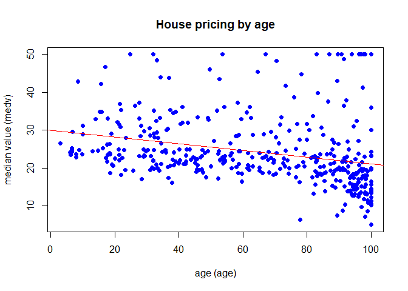

Gonzalez_Mario_40
================
PWD-3
05/10/2022

- <a href="#loading-the-dataset" id="toc-loading-the-dataset">Loading the
  dataset.</a>
- <a href="#split-the-dataset-into-training-and-test-sets"
  id="toc-split-the-dataset-into-training-and-test-sets">Split the dataset
  into training and test sets</a>
- <a href="#check-relationship-between-variables"
  id="toc-check-relationship-between-variables">Check relationship between
  variables</a>
- <a href="#fit-a-linear-model-of-the-house-pricing-in-function-of-age"
  id="toc-fit-a-linear-model-of-the-house-pricing-in-function-of-age">Fit
  a linear model of the house pricing in function of age</a>
- <a href="#train-a-linear-model-using-age-and-lstat-as-predictors"
  id="toc-train-a-linear-model-using-age-and-lstat-as-predictors">Train a
  linear model using <em>age</em> and <em>lstat</em> as predictors</a>
- <a href="#training-a-model-using-all-of-the-variables-in-the-dataset"
  id="toc-training-a-model-using-all-of-the-variables-in-the-dataset">Training
  a model using all of the variables in the dataset</a>

In this document we will explore the Multiple Linear Regression using
the **Boston** dataset. This dataset records the median values of the
houses of 506 neighbourhoods in Boston. We have the dependent variable
`medv` in the dataset as the median value of the houses.

# Loading the dataset.

In this section, we will upload the *Boston* dataset into the R session
from the *MASS* package.

``` r
library(MASS)
data(Boston)
knitr::kable(head(Boston))
```

|    crim |  zn | indus | chas |   nox |    rm |  age |    dis | rad | tax | ptratio |  black | lstat | medv |
|--------:|----:|------:|-----:|------:|------:|-----:|-------:|----:|----:|--------:|-------:|------:|-----:|
| 0.00632 |  18 |  2.31 |    0 | 0.538 | 6.575 | 65.2 | 4.0900 |   1 | 296 |    15.3 | 396.90 |  4.98 | 24.0 |
| 0.02731 |   0 |  7.07 |    0 | 0.469 | 6.421 | 78.9 | 4.9671 |   2 | 242 |    17.8 | 396.90 |  9.14 | 21.6 |
| 0.02729 |   0 |  7.07 |    0 | 0.469 | 7.185 | 61.1 | 4.9671 |   2 | 242 |    17.8 | 392.83 |  4.03 | 34.7 |
| 0.03237 |   0 |  2.18 |    0 | 0.458 | 6.998 | 45.8 | 6.0622 |   3 | 222 |    18.7 | 394.63 |  2.94 | 33.4 |
| 0.06905 |   0 |  2.18 |    0 | 0.458 | 7.147 | 54.2 | 6.0622 |   3 | 222 |    18.7 | 396.90 |  5.33 | 36.2 |
| 0.02985 |   0 |  2.18 |    0 | 0.458 | 6.430 | 58.7 | 6.0622 |   3 | 222 |    18.7 | 394.12 |  5.21 | 28.7 |

As we can see, we can see the different variables that compose the
dataset, and at the right side of the table, we can see the *medv* posed
as the median value of the houses.

# Split the dataset into training and test sets

In this section, we will take the dataset and split it into fixed sets
*(**training** set and **test** set)*. We will take the *train-test
ratio* will be 80% to 20% of training and test sets, meaning that we
will take 400 observations for the training set and the rest of the
observations for the test set.

``` r
boston_train <- Boston[1:400, ]
boston_test <- Boston[401:506, ]

summary(boston_train)
```

    ##       crim                zn             indus             chas       
    ##  Min.   : 0.00632   Min.   :  0.00   Min.   : 0.460   Min.   :0.0000  
    ##  1st Qu.: 0.06610   1st Qu.:  0.00   1st Qu.: 4.125   1st Qu.:0.0000  
    ##  Median : 0.16073   Median :  0.00   Median : 7.015   Median :0.0000  
    ##  Mean   : 1.75086   Mean   : 14.38   Mean   : 9.416   Mean   :0.0875  
    ##  3rd Qu.: 0.73192   3rd Qu.: 21.00   3rd Qu.:13.920   3rd Qu.:0.0000  
    ##  Max.   :88.97620   Max.   :100.00   Max.   :25.650   Max.   :1.0000  
    ##       nox               rm             age              dis        
    ##  Min.   :0.3850   Min.   :3.561   Min.   :  2.90   Min.   : 1.130  
    ##  1st Qu.:0.4420   1st Qu.:5.891   1st Qu.: 37.67   1st Qu.: 2.341  
    ##  Median :0.5055   Median :6.228   Median : 68.75   Median : 3.876  
    ##  Mean   :0.5301   Mean   :6.336   Mean   : 64.08   Mean   : 4.200  
    ##  3rd Qu.:0.5810   3rd Qu.:6.686   3rd Qu.: 91.90   3rd Qu.: 5.659  
    ##  Max.   :0.8710   Max.   :8.780   Max.   :100.00   Max.   :12.127  
    ##       rad              tax           ptratio         black      
    ##  Min.   : 1.000   Min.   :187.0   Min.   :12.6   Min.   : 70.8  
    ##  1st Qu.: 4.000   1st Qu.:276.0   1st Qu.:16.6   1st Qu.:381.2  
    ##  Median : 5.000   Median :307.0   Median :18.4   Median :392.5  
    ##  Mean   : 6.617   Mean   :349.8   Mean   :18.0   Mean   :379.9  
    ##  3rd Qu.: 6.000   3rd Qu.:403.0   3rd Qu.:20.2   3rd Qu.:396.5  
    ##  Max.   :24.000   Max.   :666.0   Max.   :22.0   Max.   :396.9  
    ##      lstat             medv      
    ##  Min.   : 1.730   Min.   : 5.00  
    ##  1st Qu.: 6.285   1st Qu.:18.90  
    ##  Median : 9.605   Median :22.50  
    ##  Mean   :11.251   Mean   :24.33  
    ##  3rd Qu.:14.477   3rd Qu.:28.25  
    ##  Max.   :37.970   Max.   :50.00

``` r
knitr::kable(head(boston_train))
```

|    crim |  zn | indus | chas |   nox |    rm |  age |    dis | rad | tax | ptratio |  black | lstat | medv |
|--------:|----:|------:|-----:|------:|------:|-----:|-------:|----:|----:|--------:|-------:|------:|-----:|
| 0.00632 |  18 |  2.31 |    0 | 0.538 | 6.575 | 65.2 | 4.0900 |   1 | 296 |    15.3 | 396.90 |  4.98 | 24.0 |
| 0.02731 |   0 |  7.07 |    0 | 0.469 | 6.421 | 78.9 | 4.9671 |   2 | 242 |    17.8 | 396.90 |  9.14 | 21.6 |
| 0.02729 |   0 |  7.07 |    0 | 0.469 | 7.185 | 61.1 | 4.9671 |   2 | 242 |    17.8 | 392.83 |  4.03 | 34.7 |
| 0.03237 |   0 |  2.18 |    0 | 0.458 | 6.998 | 45.8 | 6.0622 |   3 | 222 |    18.7 | 394.63 |  2.94 | 33.4 |
| 0.06905 |   0 |  2.18 |    0 | 0.458 | 7.147 | 54.2 | 6.0622 |   3 | 222 |    18.7 | 396.90 |  5.33 | 36.2 |
| 0.02985 |   0 |  2.18 |    0 | 0.458 | 6.430 | 58.7 | 6.0622 |   3 | 222 |    18.7 | 394.12 |  5.21 | 28.7 |

``` r
summary(boston_test)
```

    ##       crim                zn        indus            chas        nox        
    ##  Min.   : 0.04527   Min.   :0   Min.   : 9.69   Min.   :0   Min.   :0.5320  
    ##  1st Qu.: 4.36716   1st Qu.:0   1st Qu.:18.10   1st Qu.:0   1st Qu.:0.5850  
    ##  Median : 7.46495   Median :0   Median :18.10   Median :0   Median :0.6550  
    ##  Mean   :10.64245   Mean   :0   Mean   :17.63   Mean   :0   Mean   :0.6474  
    ##  3rd Qu.:12.66352   3rd Qu.:0   3rd Qu.:18.10   3rd Qu.:0   3rd Qu.:0.7130  
    ##  Max.   :73.53410   Max.   :0   Max.   :27.74   Max.   :0   Max.   :0.7400  
    ##        rm             age              dis             rad       
    ##  Min.   :4.138   Min.   : 28.80   Min.   :1.178   Min.   : 1.00  
    ##  1st Qu.:5.800   1st Qu.: 78.25   1st Qu.:1.864   1st Qu.:24.00  
    ##  Median :6.157   Median : 90.75   Median :2.178   Median :24.00  
    ##  Mean   :6.090   Mean   : 85.53   Mean   :2.268   Mean   :20.61  
    ##  3rd Qu.:6.423   3rd Qu.: 97.38   3rd Qu.:2.560   3rd Qu.:24.00  
    ##  Max.   :7.393   Max.   :100.00   Max.   :4.098   Max.   :24.00  
    ##       tax           ptratio          black            lstat      
    ##  Min.   :273.0   Min.   :19.20   Min.   :  0.32   Min.   : 5.64  
    ##  1st Qu.:666.0   1st Qu.:20.20   1st Qu.: 97.03   1st Qu.:14.11  
    ##  Median :666.0   Median :20.20   Median :362.01   Median :17.62  
    ##  Mean   :628.8   Mean   :20.16   Mean   :269.20   Mean   :17.95  
    ##  3rd Qu.:666.0   3rd Qu.:20.20   3rd Qu.:394.77   3rd Qu.:21.30  
    ##  Max.   :711.0   Max.   :21.00   Max.   :396.90   Max.   :36.98  
    ##       medv      
    ##  Min.   : 5.00  
    ##  1st Qu.:11.90  
    ##  Median :15.20  
    ##  Mean   :15.73  
    ##  3rd Qu.:19.90  
    ##  Max.   :29.80

``` r
knitr::kable(head(boston_test))
```

|     |     crim |  zn | indus | chas |   nox |    rm |   age |    dis | rad | tax | ptratio |  black | lstat | medv |
|:----|---------:|----:|------:|-----:|------:|------:|------:|-------:|----:|----:|--------:|-------:|------:|-----:|
| 401 | 25.04610 |   0 |  18.1 |    0 | 0.693 | 5.987 | 100.0 | 1.5888 |  24 | 666 |    20.2 | 396.90 | 26.77 |  5.6 |
| 402 | 14.23620 |   0 |  18.1 |    0 | 0.693 | 6.343 | 100.0 | 1.5741 |  24 | 666 |    20.2 | 396.90 | 20.32 |  7.2 |
| 403 |  9.59571 |   0 |  18.1 |    0 | 0.693 | 6.404 | 100.0 | 1.6390 |  24 | 666 |    20.2 | 376.11 | 20.31 | 12.1 |
| 404 | 24.80170 |   0 |  18.1 |    0 | 0.693 | 5.349 |  96.0 | 1.7028 |  24 | 666 |    20.2 | 396.90 | 19.77 |  8.3 |
| 405 | 41.52920 |   0 |  18.1 |    0 | 0.693 | 5.531 |  85.4 | 1.6074 |  24 | 666 |    20.2 | 329.46 | 27.38 |  8.5 |
| 406 | 67.92080 |   0 |  18.1 |    0 | 0.693 | 5.683 | 100.0 | 1.4254 |  24 | 666 |    20.2 | 384.97 | 22.98 |  5.0 |

# Check relationship between variables

We then have to check if there is a linear relationship between the
`age` and `medv` variables.

``` r
print(cor(boston_train$age, boston_train$medv))
```

    ## [1] -0.278153

As we can see from the result, there is a very weak linear relationship
between the `age` and the `medv` variables of the dataset. This means
that if there is a relationship between both variables, it is definitely
a non-linear relationship, and it is more complex than a simple line.

# Fit a linear model of the house pricing in function of age

In this step we will fit a model of the house pricing based on the `age`
variable and visualize its behaviour with the actual data.

``` r
age_model <- lm(medv ~ age, data = boston_train)
summary(age_model)
```

    ## 
    ## Call:
    ## lm(formula = medv ~ age, data = boston_train)
    ## 
    ## Residuals:
    ##     Min      1Q  Median      3Q     Max 
    ## -16.828  -5.409  -2.538   2.881  28.824 
    ## 
    ## Coefficients:
    ##             Estimate Std. Error t value Pr(>|t|)    
    ## (Intercept) 29.97014    1.07047  27.997  < 2e-16 ***
    ## age         -0.08794    0.01522  -5.777 1.53e-08 ***
    ## ---
    ## Signif. codes:  0 '***' 0.001 '**' 0.01 '*' 0.05 '.' 0.1 ' ' 1
    ## 
    ## Residual standard error: 8.815 on 398 degrees of freedom
    ## Multiple R-squared:  0.07737,    Adjusted R-squared:  0.07505 
    ## F-statistic: 33.38 on 1 and 398 DF,  p-value: 1.534e-08

``` r
plot(
    boston_train$age,
    boston_train$medv,
    col = "blue",
    cex = 1,
    pch = 16,
    main = "House pricing by age",
    ylab = "median value (medv)",
    xlab = "age (age)"
)
abline(age_model, col = "red")
```

<!-- -->

As we can see in the model, the regression line is described as a linear
model as we used `medv ~ age` in the linear model fitting. This gave us
a linear function with the form
,
using the parameters seen above.

# Train a linear model using *age* and *lstat* as predictors

In this step we will generate a model that will describe the behaviour
of the `medv` variable using the `age` and `lstat` variables as
predictors. Taking in account that in the *PW2* document we used a
similar model using `lstat` as a predictor, we will apply the same
modification as that model, and use `log(lstat)` instead of using it
directly.

``` r
lstat_age_model <- lm(medv ~ log(lstat) + age, data = boston_train)
summary(lstat_age_model)
```

    ## 
    ## Call:
    ## lm(formula = medv ~ log(lstat) + age, data = boston_train)
    ## 
    ## Residuals:
    ##      Min       1Q   Median       3Q      Max 
    ## -13.5262  -3.3942  -0.8392   2.7503  22.9450 
    ## 
    ## Coefficients:
    ##              Estimate Std. Error t value Pr(>|t|)    
    ## (Intercept)  51.60212    1.03643  49.788  < 2e-16 ***
    ## log(lstat)  -14.33897    0.53904 -26.601  < 2e-16 ***
    ## age           0.07779    0.01106   7.034 8.85e-12 ***
    ## ---
    ## Signif. codes:  0 '***' 0.001 '**' 0.01 '*' 0.05 '.' 0.1 ' ' 1
    ## 
    ## Residual standard error: 5.292 on 397 degrees of freedom
    ## Multiple R-squared:  0.6684, Adjusted R-squared:  0.6667 
    ## F-statistic: 400.1 on 2 and 397 DF,  p-value: < 2.2e-16

In this case, we can see that the obtained model is a non-linear model,
described by the equation
 + b_2x_2 + c").
As we can see, the model uses now two factor parameters
 and
 for the
predictors. The summary of the model shows levels of significance for
} < 2*10^{-16}")
and
,
which means a very high level of significance for each of the predictor
parameters. The levels of significance show that the variable
`log(lstat)` is more significant to the model than the `age` variable,
although the `age` is highly significant to this model.

The summary of this model shows as a *F-statistic* score of 400.1 using
the Fisher method with 397 degrees of freedom. This score leads us to
obtain a general
 value of
,
which means that we are confident *(more than 99.99%)* that the model
correctly describes the behaviour of the data we are presenting. To
summarize, we can say that **this model is highly significant as a
whole**.

# Training a model using all of the variables in the dataset
